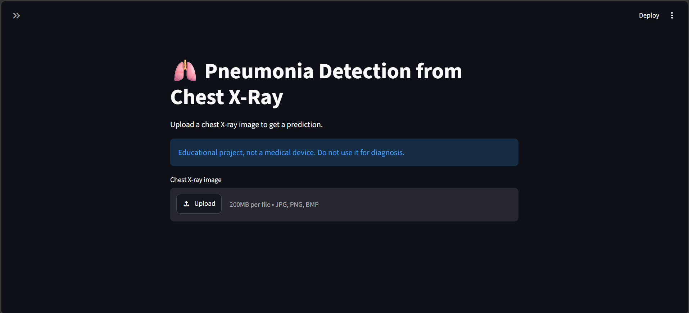
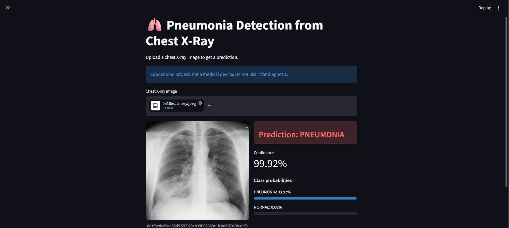

# 🫁 Pneumonia Detection from Chest X-Rays

A CNN classifier that labels a chest X-ray as **NORMAL** or **PNEUMONIA**, built with MobileNetV2 transfer learning (TensorFlow / Keras) and wrapped in a Streamlit app where you can upload an image and get a prediction.

> **Educational project, not a medical device.** Do not use it for diagnosis.

## Demo

**Upload page**



**Prediction result**



## Highlights

- MobileNetV2 (ImageNet weights) adapted to **single-channel grayscale** input by summing the first conv kernel over its RGB channels. The transfer is verified with a numerical check (relative error 7.07 × 10⁻⁶).
- Class weights to handle the 2.89 : 1 imbalance between PNEUMONIA and NORMAL in the training set.
- Mild augmentation (rotation, zoom, shift) with **no horizontal flip**, since a flipped chest X-ray is not realistic.
- Fast `tf.data` pipeline with shuffling, parallel decoding and prefetching.
- Full evaluation: classification report, confusion matrix, sensitivity / specificity and ROC curve.
- Streamlit app for single-image inference.

## Dataset

5,856 chest X-ray images, two classes, split into `train`, `val` and `test` folders. The dataset is not included in this repository.

| Split | NORMAL | PNEUMONIA | Total |
|---|---|---|---|
| train | 1341 | 3875 | 5216 |
| val | 8 | 8 | 16 |
| test | 234 | 390 | 624 |

No corrupted images were found. Image sizes vary a lot, so all images are resized to 224 × 224.

## Model

| Part | Details |
|---|---|
| Input | 224 × 224 × 1 (grayscale, raw 0–255) |
| Preprocessing | Augmentation (train only) → `Rescaling` to [-1, 1] |
| Backbone | MobileNetV2, ImageNet weights, frozen |
| Head | `GlobalAveragePooling2D` → `Dense(256, relu)` → `Dropout(0.3)` → `Dense(1, sigmoid)` |
| Parameters | 2,585,601 total, 328,193 trainable |
| Loss / optimizer | Binary cross-entropy, Adam (lr = 0.001) |
| Class weights | NORMAL 1.945, PNEUMONIA 0.673 |
| Training | Batch size 32, early stopping on `val_loss` (patience 10). Stopped after 15 epochs, best epoch 5 |
| Saved model | `pneumonia_mobilenetv2.keras` (12.94 MB) |

## Results

Test set (624 images):

| Metric | Value |
|---|---|
| Accuracy | 0.9054 |
| ROC-AUC | 0.962 |
| Sensitivity (PNEUMONIA recall) | 0.9667 |
| Specificity (NORMAL recall) | 0.8034 |
| PNEUMONIA precision / F1 | 0.89 / 0.93 |
| NORMAL precision / F1 | 0.94 / 0.86 |

Confusion matrix:

| | Predicted NORMAL | Predicted PNEUMONIA |
|---|---|---|
| **True NORMAL** | 188 | 46 |
| **True PNEUMONIA** | 13 | 377 |

The model finds almost all pneumonia cases (377 of 390) but flags 46 of 234 healthy X-rays as pneumonia.

> **Important:** the validation folder has only 16 images, so the **test set was used as `validation_data`** during training. It influenced early stopping and the choice of the best epoch, which means these scores are optimistic and not a fully independent test result.

## Project Structure

```
pneumonia-detection/
├── app.py                        # Streamlit app
├── Pneumonia-detction.ipynb      # training and evaluation notebook
├── requirements.txt
├── pneumonia_mobilenetv2.keras   # trained model (not in the repo by default)
├── screenshots/
│   ├── 01_home.png
│   └── 02_prediction.png
└── README.md
```

## Getting Started

**1. Install dependencies** (Python 3.9–3.13)

```bash
python -m venv venv
venv\Scripts\activate          # Windows
# source venv/bin/activate     # Mac / Linux

pip install -r requirements.txt
```

**2. Get the model**

Run the notebook to train and save `pneumonia_mobilenetv2.keras`, then put the file next to `app.py`.

**3. Run the app**

```bash
streamlit run app.py
```

Open http://localhost:8501, upload a JPG, PNG or BMP chest X-ray and read the prediction.

**Notebook**

The notebook was developed on Google Colab with a GPU and loads the dataset from a zip on Google Drive. Change `zip_path` in the data loading cell, or set `USE_ZIP = False` and point `extract_path` to an already extracted folder.

## Limitations

- The test set was also used for validation (see above), so the reported metrics are optimistic.
- Specificity is 80.3%, so false alarms are common.
- Results come from a single training run and a single dataset, with no external validation.
- Some X-rays contain markers, tubes or leads. It is not verified whether the model relies on them.
- The app accepts any image and will always return a prediction, even for pictures that are not chest X-rays.

## Future Work

- Re-split the data (`RESPLIT_VAL = True` in the notebook) and keep the test set untouched for one final evaluation.
- Choose the decision threshold on a validation set instead of fixing it at 0.5.
- Fine-tune the top layers of MobileNetV2 with a low learning rate.
- Add Grad-CAM heatmaps to check what the model looks at.
- Repeat training with several seeds and test on an external dataset.

## Tech Stack

Python · TensorFlow / Keras · scikit-learn · NumPy · pandas · Matplotlib · Seaborn · Streamlit

## Author

**Abhay**
GitHub: [ENGABHAY](https://github.com/ENGABHAY) · LinkedIn: [kadamabhay](https://linkedin.com/in/kadamabhay)
